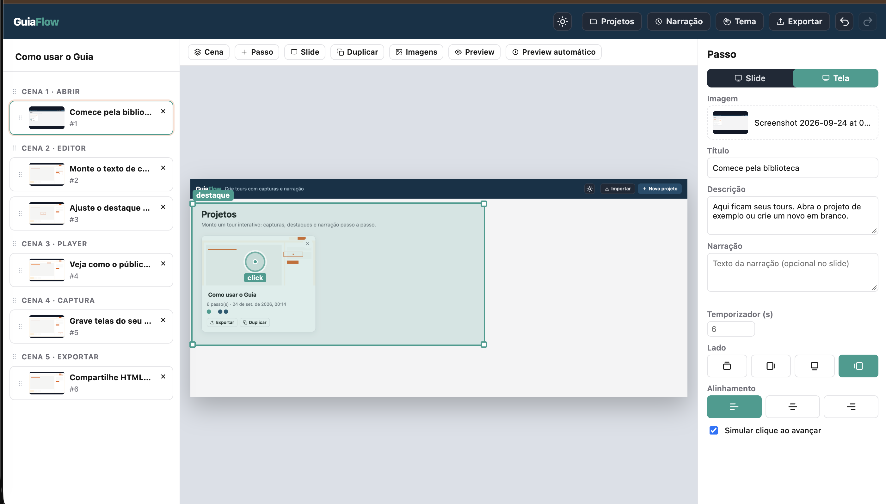
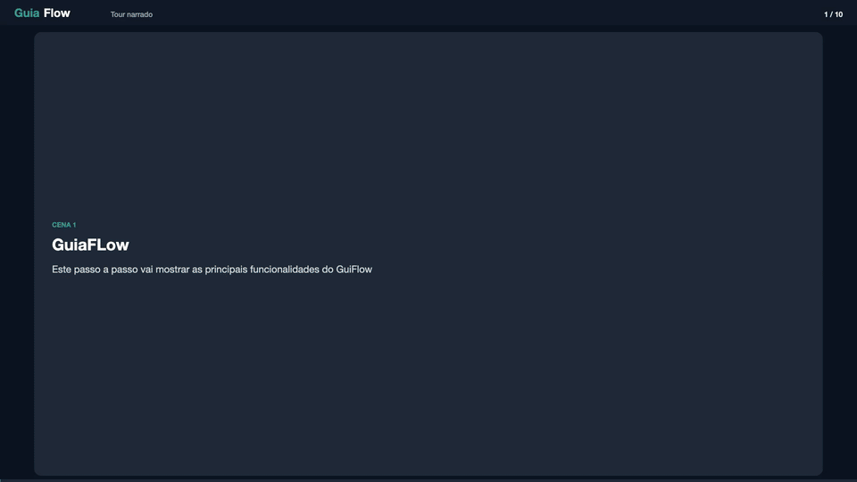

# GuiaFlow





Editor e player de tours com capturas de tela, destaque, clique simulado e narração. Inclui uma extensão Chrome para gravar o produto e um app desktop (Electron) com captura embutida.

A interface está em português, espanhol e inglês. O idioma segue o do navegador; se não for um desses três, cai em inglês. No editor, o seletor fica na barra superior (PT, ES, EN). Na extensão, o mesmo seletor fica no popup e vale também para a barra de captura na página.

## Começar no navegador

```bash
npm start
```

Abre em `http://localhost:4173`. O endereço publicado é [https://guiaflow-seven.vercel.app](https://guiaflow-seven.vercel.app). Na primeira visita a biblioteca recebe o projeto **Como usar o Guia**.

### Extensão de captura

Instale pela [Chrome Web Store](https://chromewebstore.google.com/detail/guiaflow-%E2%80%94-captura/bogjjfmcceccnepkpijiohglllbgbofd). O manual está em [`ajuda.html`](ajuda.html).

Para desenvolver a extensão localmente:

1. `npm run pack:extension` (ou carregue a pasta `extension/`)
2. Em `chrome://extensions`, ative o modo do desenvolvedor e carregue a pasta da extensão
3. No popup, o campo Editor deve ser a mesma origem do site (`https://guiaflow-seven.vercel.app`, ou `http://localhost:4173` no desenvolvimento)
4. No popup, escolha PT, ES ou EN se quiser um idioma diferente do navegador
5. Inicie a captura na aba do produto, fotografe, marque o clique e crie o projeto

## App desktop

```bash
npm install
npm run desktop
```

Gera a pasta de distribuição local (sem assinatura):

```bash
npm run dist:desktop
```

No desktop, use **Capturar** no editor: abre uma janela com a página do produto, fotografa e monta o projeto. No navegador continue com a extensão.

## Exportar

- **HTML navegável** — um arquivo único com o tour
- **Vídeo MP4** — frames do tour via WebCodecs; se o encoder não existir, cai em `MediaRecorder` (pode sair WebM)

## Testes

```bash
node --test extension/lib/*.test.js scripts/*.test.js
```

## Licença

MIT — ver [`LICENSE`](LICENSE).

### Terceiros

- [driver.js](https://github.com/kamranahmedse/driver.js) 1.3.6 — MIT © Kamran Ahmed (`vendor/driver/`)
- [mp4-muxer](https://github.com/Vanilagy/mp4-muxer) — MIT (`vendor/mp4-muxer/`)
- O build Electron inclui Chromium; o empacotador gera os avisos em `LICENSES.chromium.html` na pasta de saída

Este repositório não empacota ffmpeg nem libx264.
